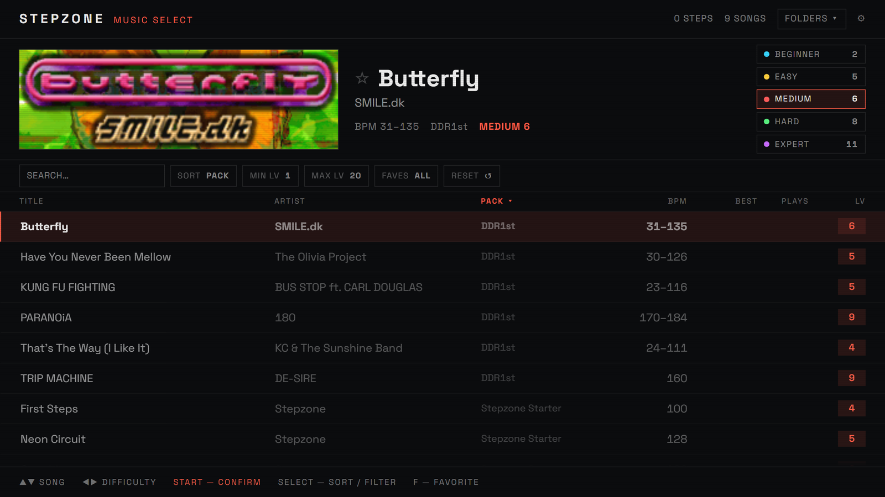
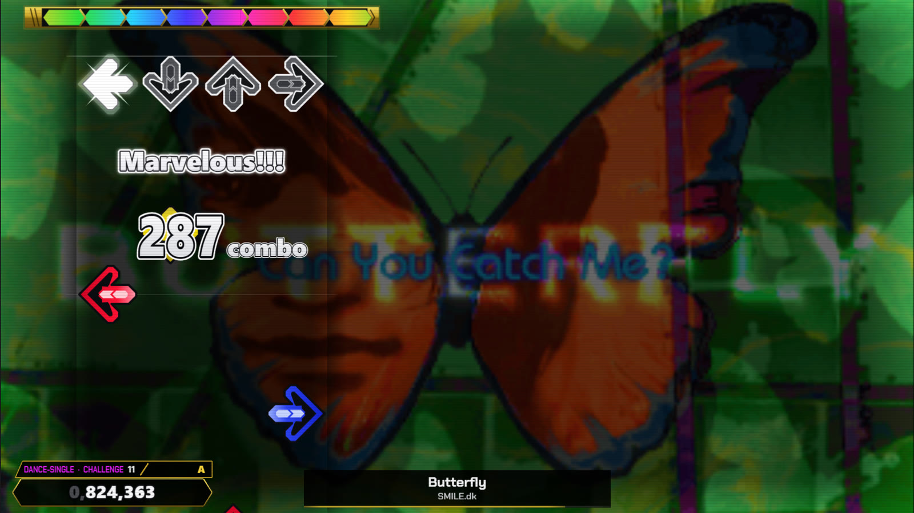
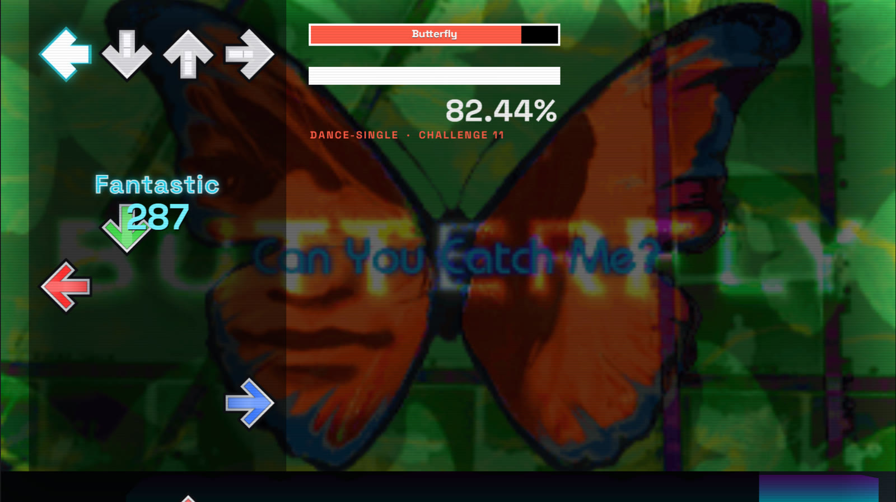

# Stepzone

A web-based DDR / StepMania-compatible rhythm **track player**. The engine is
framework-free TypeScript; the app shell is React. It reads real `.sm`/`.ssc`
simfiles and plays them in the browser with sample-accurate timing and a
WebGPU note field.

**[▸ Play it live](https://stepzone-omega.vercel.app/)** — Chrome or Edge (WebGPU required).



Built as a ground-up reimplementation of the
[ITGmania](https://github.com/itgmania/itgmania) / StepMania simfile formats
and game logic.

## Running

```
npm install     # Node ≥ 22.6 required (built on Node 24 LTS)
npm run dev     # dev server → http://localhost:5173
npm test        # unit tests: MSD parser, timing, note grid, sync clock, judgment, tech counts
npm run build   # strict typecheck + production build
```

Songs load straight from disk: pick (or drop) song folders, packs, or whole
Songs directories on the song-select screen — the FOLDERS panel manages the
list (enable/disable/remove). In Chromium browsers every folder is remembered,
so the library reloads on the next visit after a single keypress re-grant
(pick "Allow on every visit" in the prompt to make it fully automatic).

Play with <kbd>←</kbd> <kbd>↓</kbd> <kbd>↑</kbd> <kbd>→</kbd> (or D F J K), or a
gamepad / dance pad. The "Inspect" tab shows the parsed song/timing/notes.

## Rendering

The note field renders on **WebGPU**: one instanced-quad pipeline over a
baked texture atlas draws the whole frame in a handful of draw calls, with no
per-frame canvas work. Two looks ship on the same field through a `GpuSkin`
split — an arcade (DDR A3) skin and an ITG (Simply Love) skin — picked in
Player Options. WebGPU is required to play; there is no canvas fallback.

|              Arcade — DDR A3              |          ITG — Simply Love          |
| :---------------------------------------: | :---------------------------------: |
|  |  |

An in-app render benchmark (OPTIONS → DISPLAY → **Run render benchmark**, or
open `/?bench=auto`) measures the real GPU time of each presented frame via
WebGPU timestamp queries. The design, the pass order, and the numbers are in
[`docs/RENDER-PERF.md`](docs/RENDER-PERF.md).

Song backgrounds (movies included) play behind the field, kept in sync with the
music by their `#BGCHANGES` trigger and a playback-rate lock.

## Song analysis

The song-select screen shows a per-chart breakdown beside the leaderboard: a
notes-per-second density graph with peak NPS, the note tallies
(steps/jumps/hands/holds/rolls/mines), and the ITG "tech" counts — Crossovers,
Footswitches, Sideswitches, Jacks, and Brackets. Those come from a faithful
TypeScript port of ITGmania's StepParity foot-placement solver and TechCounts
classifier — the full cost model, in emulated 32-bit float — validated against
the compiled C++ on a real song library to match the game exactly.

## Online play

Scores post to global per-chart leaderboards (pad-only, guarded by a
replay-verified re-simulation), and players can race the same chart in real time
in persistent peer-to-peer rooms — the host picks the song, files stream over the
data channels, and each player's live score bar streams between machines.
Deployed on Vercel + Neon.

## Low latency

Timing accuracy is the whole game. The clock is driven by the Web Audio
`AudioContext`, input is timestamped at the event (not the frame), and the two
are reconciled through `AudioContext.getOutputTimestamp()`. The full strategy,
the pitfalls, and how the code embodies them are in
[`docs/LATENCY.md`](docs/LATENCY.md).

## Roadmap

See [`docs/ROADMAP.md`](docs/ROADMAP.md). M1–M5 (parse/time, the judgment
engine, the playable slice, real songs, player features) are done. Next up:
edge-case completeness — routine charts, chord-cohesion combo, round-trip
serialization / `ChartKey` hashing.
