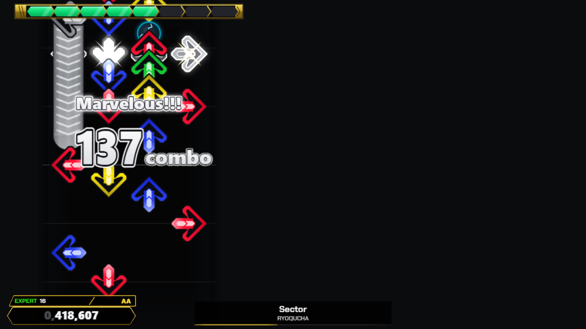
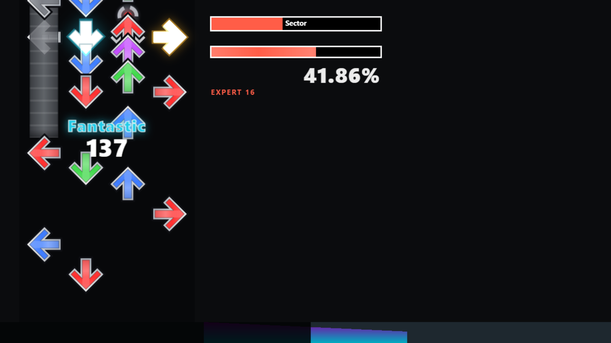

# Stepzone

A web-based DDR / StepMania-compatible rhythm **track player**. The engine is
framework-free TypeScript; the app shell is React. It reads real `.sm`/`.ssc`
simfiles and plays them in the browser with sample-accurate timing and a
WebGPU note field.


Built from the reimplementation spec in
[`../itgmania/Docs/TrackPlayerSpec/`](../itgmania/Docs/TrackPlayerSpec/), which
documents the StepMania/ITGmania formats and game logic in detail. Each module
here cites the spec doc it implements.

## Status

**Milestone 5 — Player features (mostly done).** Real song folders and packs
play end to end in the browser: a Web Audio clock, keyboard and gamepad input
judged on the event timestamp, a WebGPU note field (arcade + ITG skins), and
combo/score/life/grade with a results screen — plus song select with
search/favorites, persisted options (scroll speed, music rate, sync offset, key
rebinding, mirror/turn mods), and an auto-calibration screen. The pure layers
underneath (parsing, timing, and the judgment engine) are covered by unit
tests, including the spec's worked example and its input trace reproduced
number-for-number.

```
npm install     # Node ≥ 22.6 required (built on Node 24 LTS)
npm run dev     # dev server → http://localhost:5173
npm test        # unit tests: MSD parser, timing, note grid, sync clock, judgment
npm run build   # strict typecheck + production build
```

Songs load straight from disk: pick (or drop) song folders, packs, or whole
Songs directories on the song-select screen — the FOLDERS panel manages the
list (enable/disable/remove). In Chromium browsers every folder is remembered,
so the library reloads on the next visit after a single keypress re-grant
(pick "Allow on every visit" in the prompt to make it fully automatic).

Play with <kbd>←</kbd> <kbd>↓</kbd> <kbd>↑</kbd> <kbd>→</kbd> (or D F J K), or a
gamepad / dance pad. The "Inspect" tab shows the parsed song/timing/notes.

## Architecture

The **engine** (`src/notes`, `src/timing`, `src/parse`, `src/song`,
`src/gameplay`, `src/audio`) imports no React and no DOM APIs, so it is fully
unit-tested in Node and could run headless. The **app** (`src/ui`,
`src/main.tsx`) is the React shell. The `src/audio` clock is the one
browser-coupled engine piece, and even there the timing math is a pure, tested
`SyncMap`.

```
src/
  notes/      noteTypes, noteData, noteGrid, transforms  (spec doc 3)
  timing/     segments, timingData (beat<->second)  (spec doc 2)
  parse/      msd tokenizer, ssc, sm, loader         (spec doc 1)
  song/       song, steps, difficulty, stepsType     (spec doc 5)
  audio/      syncMap (pure), clock (Web Audio)       (spec doc 6)
  input/      key/gamepad -> column mapping           (spec doc 7)
  render/     WebGPU note field + skins, scroll math   (spec doc 8)
  gameplay/   judgment, scoring, life                 (spec doc 4)
  game/       the play-loop orchestrator              (spec doc 9)
  io/         song folders, packs, remembered folder handle
  app/        persisted settings / favorites / scores
  ui/         React components
tests/        vitest suites (mirror the engine)
docs/
  LATENCY.md      how we get low latency right on the web
  RENDER-PERF.md  the WebGPU note field + render benchmark
  ROADMAP.md      milestones
```

There is no barrel module: the app and tests deep-import from the subfolders
directly (e.g. `src/timing/timingData`).

## Rendering

The note field renders on **WebGPU**: one instanced-quad pipeline over a
baked texture atlas draws the whole frame in a handful of draw calls, with no
per-frame canvas work. Two looks ship on the same field through a `GpuSkin`
split — an arcade (DDR A3) skin and an ITG (Simply Love) skin — picked in
Player Options. WebGPU is required to play; there is no canvas fallback.

|              Arcade — DDR A3              |          ITG — Simply Love          |
| :---------------------------------------: | :---------------------------------: |
|  |  |

An in-app render benchmark (OPTIONS → DISPLAY → **Run render benchmark**, or
open `/?bench=auto`) measures the real GPU time of each presented frame via
WebGPU timestamp queries. The design, the pass order, and the numbers are in
[`docs/RENDER-PERF.md`](docs/RENDER-PERF.md).

## Low latency

Timing accuracy is the whole game. The clock is driven by the Web Audio
`AudioContext`, input is timestamped at the event (not the frame), and the two
are reconciled through `AudioContext.getOutputTimestamp()`. The full strategy,
the pitfalls, and how the code embodies them are in
[`docs/LATENCY.md`](docs/LATENCY.md).

## Roadmap

See [`docs/ROADMAP.md`](docs/ROADMAP.md). M1–M5 (parse/time, the judgment
engine, the playable slice, real songs, player features) are done. Next up:
edge-case completeness — routine charts, chord-cohesion combo, round-trip
serialization / `ChartKey` hashing.
